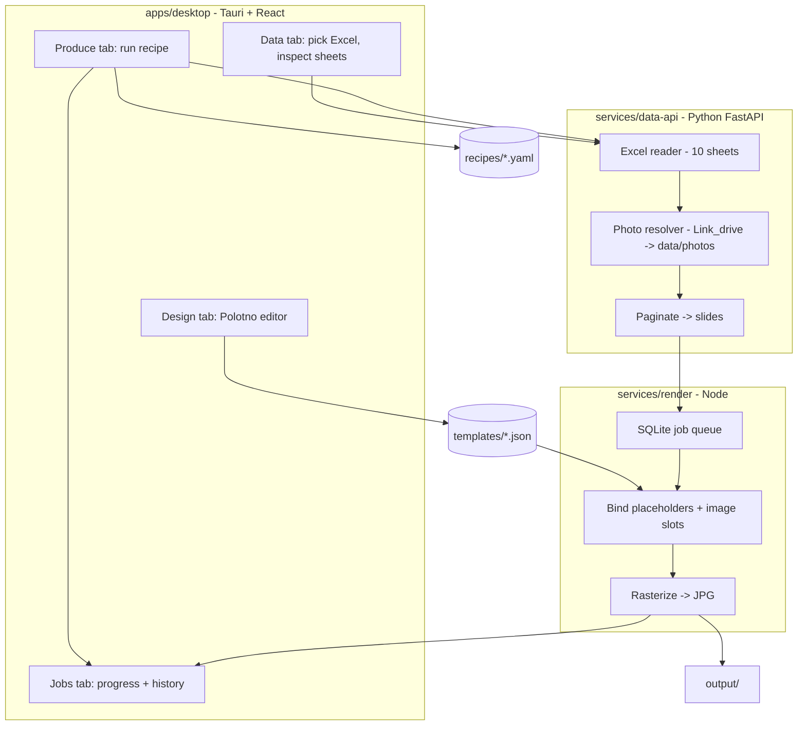

# Genposter V3 - Architecture

## Goal

Few operators, high output. One person picks a recipe and clicks Generate; the
machine produces a whole carousel (and many of them) from the Excel database and
the local photo library.

## Components

## Data flow

1. A recipe (`recipes/*.yaml`) names a sheet, an optional filter, items-per-slide,
   a template id, and output settings.
2. `data-api` reads the sheet via `data/mapping.yaml`, applies the filter, maps raw
   columns to canonical fields (`name`, `address`, `price`, `desc`, `photo_key`...),
   resolves each row's `photo_key` to real files under `data/photos/<group>/`, then
   paginates rows into slides: `{ slides: [{ index, title, items[], photos[] }] }`.
3. `render` loads the template JSON, and for each slide binds:
   - text layers: replace `{{field}}` / `{{item.field}}` tokens,
   - `list` layers: repeat a row template across `slide.items`,
   - `gallery` / image layers: fill from resolved photos,
   then rasterizes each slide to a JPG in `output/`.

## Template model

Canonical template = Genposter JSON (`packages/template-schema`). It is richer than
a flat Polotno scene because data-driven archetypes need repeating rows and photo
galleries with variable counts (pagination is 7 items/slide by default).

Layer types:

- `rect` - background blocks, dividers, badges
- `text` - static or `{{bound}}` text
- `image` - single image slot (static asset or `{{bound}}` photo)
- `list` - repeats a set of cell layers for each `slide.items[i]` (`{{item.field}}`)
- `gallery` - lays out `slide.photos` in a grid

The Polotno editor (Design tab) is used for free-form visual design; its scenes are
converted to / stored alongside Genposter templates. The built-in renderer also
reads the static subset of Polotno scene JSON. `polotno-node` is an optional render
backend when a `POLOTNO_KEY` is provided.

## Rendering backends

- `builtin` (default): SVG + sharp. Offline, license-free, fast for batch.
- `polotno` (optional): `polotno-node`, enabled when `POLOTNO_KEY` is set.

## Queue

`services/render` uses a lightweight SQLite-backed job store (tables: `jobs`,
`job_items`, `templates`). Rendering runs with a small concurrency pool. This avoids
a Redis dependency on the operator machine; the scale path is to swap the store for
BullMQ + Redis when output exceeds one machine.

## Brand

`packages/theme` is the single source of brand tokens (Riviu orange `#ff6600`),
consumed by both the desktop UI and the templates so generated images stay on-brand.
